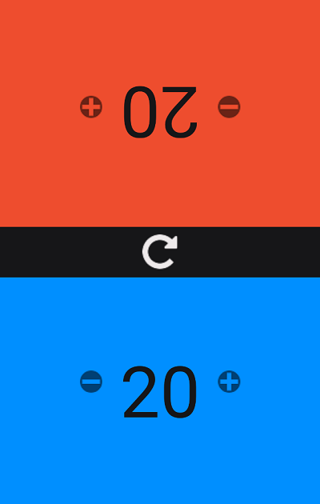

# Magic The Gathering - Life Counter

This app is a 2-player lifecounter for Magic the Gathering
Players should be seated in front of each other, since the layout contains identical controls mirror-flipped for both players.
Additional poison-counter can be (de)activated.
Each player can choose the background-color of the individual side.

In the latest release, an energy-saving mode for AMOLED-Screens has been implemented. To use this feature, hold the 'black'-button at the color selector.

## Download

Use the .apk-files included in *RELEASE*, or via [PlayStore](https://play.google.com/store/apps/details?id=com.marceljurtz.lifecounter).

## Changelog

### Nov. 19, 2016 - Version 7

 * New energy-saving mode for AMOLED-Displays

### Aug. 18, 2016 - Version 6

 * Small bugfixes and improvements
 * Swapped out some images

### Aug. 13, 2016 - Version 5

 * Improved all images to better resolution
 * Deactivated winner / loser information
 * New option to set default amount of lives

### Apr. 17, 2016 - Version 4

 * Screen-timeout deactivated

### Apr. 07, 2016 - Version 3

 * New option to select background-color
 * Improved performance

### Apr. 02, 2016 - Version 2

 * New poison-counter implemented
 * Bugfixes

### Mar. 31, 2016 - Version 1

 * First release:
   * 2 players, mirror-flipped alignment for parallel insight
   * Default with 20 lives, currently not changeable
   * Reset functionality

## Screenshots

## Icon

