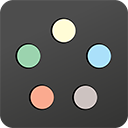
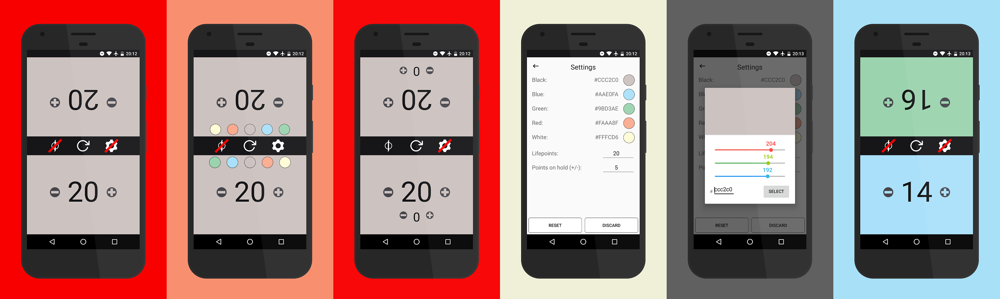

# Magic The Gathering - Life Counter



This app is a 2-player, customizable lifecounter for Magic the Gathering
Players should be seated in front of each other, since the layout contains identical controls mirror-flipped for both players.

An additional poison-counter can be (de)activated.
Each player can choose the background-color of the individual side, which can be customized individually (default mtg-colors are preset).

By holding the button to select *black* background color, the energy-saving mode for AMOLED-displays can be enabled / disabled.

## Customization

Using the settings-button, color options are toggled visible / invisible. Each player can choose their background color.

The default colors are matched to the original five colors black, blue, green, red and white.  
By holding the settings-button pressed, an options menu is popping up, where each of the colors can be customized.

Also, the player can choose

 * how much lifepoints will be used as default
 * how much points will be added / substracted by holding the plus / minus buttons pressed

All settings are saved using androids SharedPreferences.

## Download

For direct download, use the .apk-files from the [*RELEASE*-Folder](./RELEASE).

<a href="https://play.google.com/store/apps/details?id=com.marceljurtz.lifecounter"></a>

<a href="https://f-droid.org/packages/com.marceljurtz.lifecounter/"></a>

## Screenshots



## Languages

The following languages are currently supported:

* english
* german

If you'd like to contribute to the translations, feel free to contact me / submit a pull request.
The strings are located under ```/app/src/main/res/values/strings.xml```

## Changelog

### Jan. 11, 2019 - Version 2.0

* New 4-Player Mode
* New Counter Manager
* New Dicing-Feature
* New optional Game Reset Confirmation Option

### Jul. 11, 2017 - Version 11 / 1.8.2

* Fixed automatic resetting when switching between Apps
* Adjusted settings layout

### Jun. 25, 2017 - Version 10 / 1.8.1

* Added multi language support
* Added english and german content

### Jun. 23, 2017 - Version 9 / 1.8

* Added confirmation dialog to reset settings

### Jun. 20, 2017 - Version 8 / 1.7

* New settings-activity to customize colors, accessible by holding the settings-icon
  * custom colors
  * custom lifepoints
  * custom lifepoint amount on long click
* Moved customization of default lifepoints to new settings-activity

### Nov. 19, 2016 - Version 7 / 1.6

* New energy-saving mode for AMOLED-Displays

### Aug. 18, 2016 - Version 6 / 1.5

* Small bugfixes and improvements
* Swapped out some images

### Aug. 13, 2016 - Version 5 / 1.4

* Improved all images to better resolution
* Deactivated winner / loser information
* New option to set default amount of lives

### Apr. 17, 2016 - Version 4 / 1.3

* Screen-timeout deactivated

### Apr. 07, 2016 - Version 3 / 1.2

* New option to select background-color
* Improved performance

### Apr. 02, 2016 - Version 2 / 1.1

* New poison-counter implemented
* Bugfixes

### Mar. 31, 2016 - Version 1 / 1.0

* First release:
  * 2 players, mirror-flipped alignment for parallel insight
  * Default with 20 lives, currently not changeable
  * Reset functionality

## Dependencies

### Android Material Color Picker Dialog

[Android Material Color Picker Dialog by Pes8](https://github.com/Pes8/android-material-color-picker-dialog)

Also distributed under MIT-License.

## License & Legal Stuff

* This app is published under the [MIT-License](LICENSE)
* Google Play and the Google Play logo are trademarks of Google Inc.
* Check out my website for the [Impressum](https://mjurtz.com/Impressum.html).