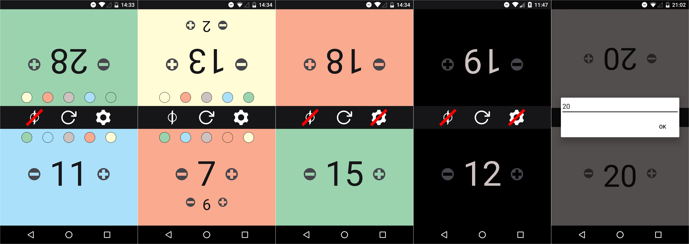

Marcels Magic The Gathering - Life Counter
===================

Diese Anwendung dient als Lebenszähler für Magic The Gathering.
Der Gebrauch beschränkt sich durch das Layout auf 2 Spieler, die beide gegenübersitzend gleichzeitig Ihre Lebensanzahl aus passender Perspektive einsehen können. Optional kann ein zusätzlicher Counter für Gift eingeblendet werden.

---

Changelog
-------------

####02.04.2016 - Version 1.1

 - Optionalen Gift-Counter eingefügt
 - Bugfixes

####31.03.2016 - Version 1.0

Erste Funktionsfähige Version abgeschlossen.

 - 2 Spieler, Anordnung kopfüber, dass beide Spieler gleichzeitig aus Ihrer perspektive die notwendigen Informationen haben.
 - Herunterzählen bis 0, Hochzählen ohne Limit
 - Standardanzahl Leben: 20
 - Resetfunktion

----------

Screenshots
-------------

----------

Icon
-------------------

---

Unterstütze mich
------------------------

Sämtliche meiner Projekte kommen aus Überzeugung ohne Werbung aus, falls du mich trotzdem unterstützen willst, sind Spenden natürlich gerne willkommen. 

Bitcoin-Adresse: 1AufUmfFezX3GQzRqu9N3vMFTs1XFKsrM5

Kontakt: jurtzmarcel@gmail.com

